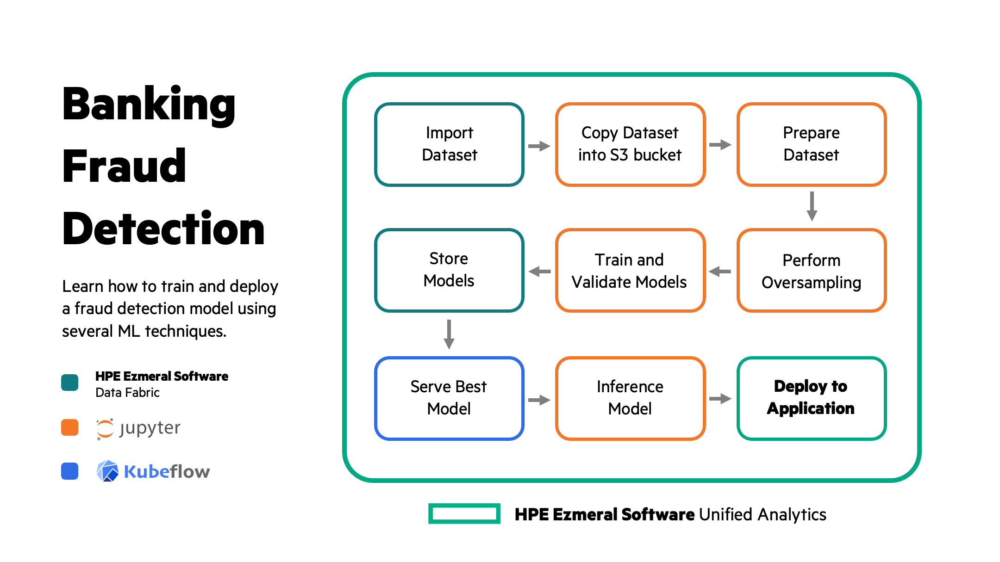

## [Demo] HPE Ezmeral Unified Analytics - Banking Fraud Detection



## Contents
1. [Introduction](#Introduction)
1. [Procedure](#procedure)
1. [How it Works](#How-does-it-work?)
1. [Clean Up](#clean-up)
1. [References](#references)

## Introduction
Fraudulent activity has permeated multiple sectors, from e-commerce and healthcare to banking and payment systems. This illicit industry amasses billions every year and is on an upward trajectory. The 2018 global economic crime survey by PwC [1] verifies this assertion, revealing that 49 percent of the 7,200 enterprises surveyed had fallen prey to some form of fraudulent conduct.

It is therefore crucial that organizations can respond to such threats in a timely manner. With HPE Ezmeral Unified Analytics, fraud detection teams can immediately get started on training enterprise-grade prediction models and deploy them to analytics applications with ease. After all, no organization wants thsir specialist teams spending days or weeks setting up the environments - they should be catching fraudsters! 

In this tutorial, you will leverage a suite of tools deployed through HPE Ezmeral Unified Analytics to train a Machine Learning (ML) model that can detect fraudulent transactions. This model will be trained using the Banksim dataset [2], a synthetically created dataset which features a combination of various customer payments, made at different intervals and
in varying amounts. Using this dataset and the appropriate tools, you will create an automated system that can detect and curtail fraudulent
activities with high accuracy.

To run this tutorial, **you will need access to a HPE Ezmeral Unified Anaytics** cluster. 

### You will learn to leverage the following tools on HPE Ezmeral Unified Analytics:
- Minio S3 Buckets
- Kubeflow Pipelines
- Kserve
- scikit-learn
- Kale (Optional)

## Getting Started

1. Login to HPE Ezmeral Unified Analytics using your credentials.
1. In the sidebar navigation menu, select "Notebooks". Click "New Notebook Server".
1. Name the notebook 'fraud-detection', then select the "Custom Notebook" dropdown menu. Under the "Image" dropdown, select the image containing `jupyter-data-science`. Allocate at least 4Gi of memory, then click "Launch". 
1. Connect to the Notebook server using the Play button on your newly created notebook. 
1. Under "Other" on the main page, launch a new terminal window. 
1. Clone the HPE Ezmeral Demo repository locally.  
      ```
        git clone https://github.com/HPEEzmeral/ezua-tutorials.git
        ```
1. Navigate to the tutorial's directory (`ezua-tutorials/demos/fraud-detection`).
1. Create the virtual environment:
    - Deactivate the base conda environment:
        ```
        conda deactivate
        ```
    - Create a new virtual environment:
       ```
       python -m venv fraud-detection
       ```
    - Activate the new virtual environment:
       ```
       source fraud-detection/bin/activate
       ```
    - Upgrade `pip`:
       ```
       pip install --upgrade pip
       ```
    - Install the dependencies:
       ```
       pip install -r requirements.txt
       ```
    - Add the new conda environment as an ipykernel:
       ```
       python -m ipykernel install --user --name=fraud-detection
       ```
    - Refresh your browser tab to access the updated environment.
1. Open the `fraud-detection.ipynb` notebook file.
1. Follow along through the notebook. 

## How does it work?

*diagram and HPE Ezmeral schpiel here*

## Clean Up

To clean up the resources used during this experiment, go to the Kubeflow Endpoints UI and delete the `fraud-detection` ISVC that was generated by the pipeline run.

## References

1. [Lavion, Didier; et al, "PwC's Global Economic Crime and Fraud Survey 2022"](https://www.pwc.com/gx/en/services/forensics/economic-crime-survey.html)
1. [Banksim Data Set Paper](http://www.msc-les.org/proceedings/emss/2014/EMSS2014_144.pdf)
1. [Kale: Kubeflow’s superfood for Data Scientists](https://github.com/kubeflow-kale/kale)
1. [Kubeflow Pipelines - A platform for building and deploying portable, scalable machine learning (ML) workflow](https://www.kubeflow.org/docs/components/pipelines/v1/introduction/)
1. [KServe - Highly scalable and standards based Model Inference Platform on Kubernetes for Trusted AI](https://kserve.github.io/website/0.11/)