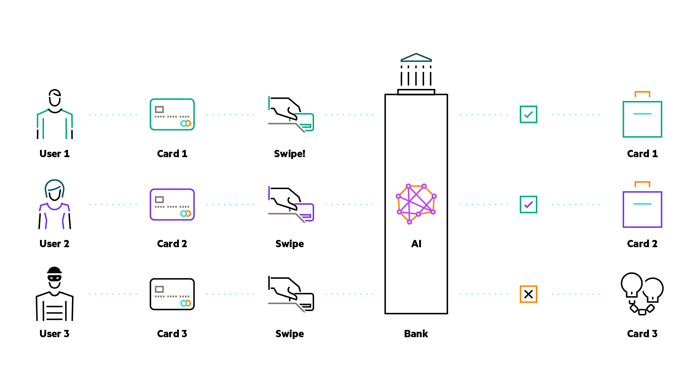

# Fraud Detection (Kubeflow Pipelines - KServe)

In this tutorial, you train a Machine Learning (ML) model to detect fraudulent transactions using the Banksim dataset
[2]. This synthetically created dataset is a combination of various customer payments, made at different intervals and
in varying amounts. Through this, you aim to create an automated system that can detect and curtail fraudulent
activities with high accuracy.

Fraudulent activity has permeated multiple sectors, from e-commerce and healthcare to banking and payment systems. This
illicit industry amasses billions every year and is on an upward trajectory. The 2018 global economic crime survey by
PwC [1] verifies this assertion, revealing that 49 percent of the 7,200 enterprises surveyed had fallen prey to some
form of fraudulent conduct.

Despite the perceived peril of fraud to businesses, the advent of sophisticated systems equips us with the tools to
detect and prevent such behaviors.

1. [What You'll Need](#what-youll-need)
1. [Procedure](#procedure)
1. [How it Works](#how-it-works)
1. [Clean Up](#clean-up)
1. [References](#references)

## What You'll Need

For this tutorial, ensure you have:

- Access to an HPE Ezmeral Unified Analytics (EzUA) cluster.

## Procedure

To complete this tutorial follow the steps below:

1. Login to your EzUA cluster, using your credentials.
1. Create a new notebook server using the `jupyter-data-science` image. Request at least 4Gi of memory for the Notebook
   server.
1. Connect to the Notebook server, launch a new terminal window, and clone the repository locally.
1. Navigate to the tutorial's directory (`ezua-tutorials/demos/fraud-detection`).
1. Launch the `fraud-detection.ipynb` notebook file.
1. Run the first section of the Notebook (i.e., "Imports & Initialization") to upload the dataset to object storage and
   setup the configuration of the experiment.
1. Enable the Kale Jupyter extension from the left side panel.
1. Click on the compile and run button and wait for Kale to compile your Notebook and submit the pipeline.
1. Wait until the pipeline completes and submits an Inference service (ISVC).
1. Navigate to the Kubeflow Endpoints UI and make sure that the ISVC is ready to accept requests.
1. Return to the Notebook and run the `Prediction` section of the Notebook to invoke the inference service.

## How it Works

This tutorial introduces the power and efficiency of Kale [3], a unique extension for JupyterLab. With Kale, you have
the ability to transform your Jupyter Notebooks directly into Kubeflow Pipelines [4], without the need to change a
single line of code or build Docker images.

Kale works behind the scenes to effortlessly convert the code cells in this Notebook into steps in a pipeline. With this
conversion, a Kubeflow Pipeline is born, designed to train not one, but four ML models simultaneously. The pipeline
trains and evaluates the models, and the top-performing model is served using KServe [5], a renowned tool used for model
serving.

Once everything is set up, you have the ability to invoke the resulting ISVC, testing your model's ability to determine
whether a particular transaction is fraudulent or genuine.

## Clean Up

To clean up the resources used during this experiment, follow the steps below:

1. Go to the Kubeflow Endpoints UI and delete the `fraud-detection` ISVC that was generated by the pipeline run.

## References

1. [Lavion, Didier; et al, "PwC's Global Economic Crime and Fraud Survey 2022"](https://www.pwc.com/gx/en/services/forensics/economic-crime-survey.html)
1. [Banksim Data Set Paper](http://www.msc-les.org/proceedings/emss/2014/EMSS2014_144.pdf)
1. [Kale: Kubeflow’s superfood for Data Scientists](https://github.com/kubeflow-kale/kale)
1. [Kubeflow Pipelines - A platform for building and deploying portable, scalable machine learning (ML) workflow](https://www.kubeflow.org/docs/components/pipelines/v1/introduction/)
1. [KServe - Highly scalable and standards based Model Inference Platform on Kubernetes for Trusted AI](https://kserve.github.io/website/0.11/)