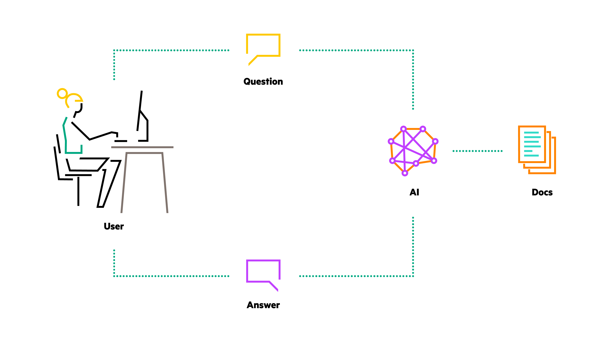
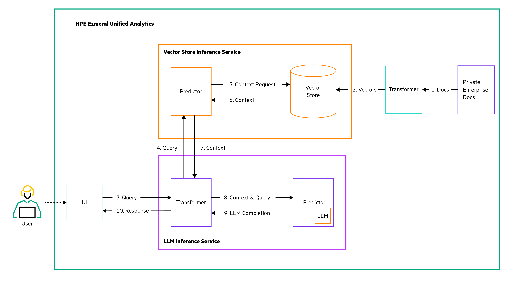

# Question Answering (KServe - MLflow)

In this tutorial, you build a question-answering system using an open-source Large Language Model
(LLM). This system can answer questions from a corpus of private documentation. To make this happen,
you deploy a Vector Store to capture and index a latent representation of each document. This setup
lets the application pull the relevant context from the user's questions, which enhances the LLM
prompt. The result? An accurate and efficient question-answering system.



1. [What You'll Need](#what-youll-need)
1. [Procedure](#procedure)
1. [Troubleshooting](#troubleshooting)
1. [How It Works](#how-it-works)
1. [Clean Up](#clean-up)
1. [References](#references)

## What You'll Need

For this tutorial, ensure you have:

- Access to an HPE Ezmeral Unified Analytics (EzUA) cluster.

## Procedure

To complete the tutorial follow the steps below:

1. Login to your EzUA cluster, using your credentials.
1. Create a new Notebook server using the
   `lr1-bd-harbor-registry.mip.storage.hpecorp.net/develop/ezkf/jupyter:v1.2.0-c98a236` image.
   Request at least `4Gi` of memory for the Notebook server.
1. Connect to the Notebook server, launch a new terminal window, and clone the repository locally.
   See the troubleshooting section if this step fails.
1. Navigate to the tutorial's directory (`ezua-tutorials/demos/rag-demos/question-answering`)
1. Install the demo prerequisites:
   ```
   pip install -r requirements.txt
   ```
1. Refresh your browser tab to access the updated environment.
1. Launch the five Notebooks in order and execute the code cells. Delect the default kernel for your
   Notebook if prompted.
1. Use the EzUA "Import Framework" wizard to upload the tarball located inside the `application`
   folder. This creates a user interface for your application. Complete the steps and wait for a new
   endpoint to become ready.
1. Connect to the endpoint and submit your questions.


## Troubleshooting

If you're operating behind a proxy, you'll need to configure several environment variables to
successfully clone the `ezua-tutorials` repository to your local machine, install its dependencies
using `pip`, and download the necessary Machine Learning (ML) models from external sources. 

To clone the repository and install the necessary Python libraries using `pip`, launch a terminal
window and execute the following commands:

- `export http_proxy=<your http proxy URL>`
- `export https_proxy=<your https proxy URL>`

> **Note**: Replace `<your http proxy URL>` and `<your https proxy URL>` with your organization's
> proxy URLs.

To download the transformer model, which converts documents into vectors, you must set an
environment variable in the first Notebook. Do this as follows:


To allow KServe to download the transformer model and the LLM set the enviroment variables defined
in Notebooks `2` and `4`.

## How It Works

This project taps into a HuggingFace [embedding model](https://huggingface.co/sentence-transformers/all-MiniLM-L6-v2)
[1] to translate the sentences and paragraphs from a private document corpus into a
multi-dimensional dense vector space [2]. By doing so, you can employ sophisticated techniques like
semantic search, empowering users to pinpoint relevant details swiftly and precisely. The generated
vectors are stored and indexed within a local [Chroma](https://www.trychroma.com/) instance, a
cloud-native, open-source embedding database [3].

Once a question is provided, the application embeds it into the previously mentioned vector space
using the same embedding model. By default, it fetches the four top relevant documents, utilizing a
particular algorithm (most commonly kNN) [4]. Subsequently, the application relays the user's
question along with the retrieved context to an LLM, ensuring the answer mirrors human-like speech.
This tutorial accommodates any GPT4ALL [5] supported architecture, but `orca-mini-3b.ggmlv3.q4_0` is
the go-to model.

Now, onto the serving details: Using [KServe](https://kserve.github.io/website/0.11/) [6] you can
set up an Inference Service (ISVC) with custom components. To do this, you need to build and push
three Docker images which KServe will use to serve both the Vector Store and the LLM. Below are the
application directories containing the respective Dockerfiles to build these images:

- Vector Store: [`dockerfiles/vectorstore`](dockerfiles/vectorstore)
- LLM Transformer: [`dockerfiles/transformer`](dockerfiles/transformer)
- LLM Model: [`dockerfiles/llm`](dockerfiles/llm)

> For your convenience, you can use the pre-built images we have prepared for you:
> - Vector Store: `dpoulopoulos/qna-vectorstore:v1.3.0-c2ab2f7`
> - LLM Predictor: `dpoulopoulos/qna-llm:v1.3.0-c2ab2f7`
> - LLM Transformer: `dpoulopoulos/qna-transformer:v1.3.0-c2ab2f7`

Once the images are ready, proceed to run the Notebooks. The project consists of four Notebooks.
Launch and run each Notebook to explore and execute the experiment end-to-end:

1. `01.create-vectorstore`: Load the documents from your private corpus (e.g., the `documents`
   folder), process them, and create the Vector Store.
1. `02.serve-vectorstore`: Create an ISVC for the Vector Store.
1. `03.document-precition` (optional): Invoke the Vector Store ISVC.
1. `04.serve-llm`: Create an ISVC for the LLM.
1. `05.question-answering`: Invoke the LLM ISVC. Post a question to the LLM ISVC and get back a
   human-like answer.

The last Notebook outlines the user's perspective. The application flow is depicted in the following
figure:



1. User: Transform raw documents into sentence embeddings.
1. User: Ingest document embeddings, documents data, and metadata in the Vector Store.
1. User: Ask a new question.
1. LLM ISVC Transformer: Intercept the request, extract the user's query, and create a new request
   to the Vector Store ISVC predictor passing the user's question in the payload.
1. Vector Store ISVC Predictor: Extract the user's question from the request of the LLM ISVC
   Transformer and ask the Vector Store for the `k` most relevant documents.
1. Vector Store: Respond to the Vector Store ISVC Predictor with a relevant context.
1. Vector Store ISVC Predictor: Respond to the LLM ISVC Transformer with the relevant context.
1. LLM ISVC Transformer: Get the most relevant documents from the Vector Store ISVC predictor
   response, create a new request to the LLM ISVC predictor passing the context and the user's
   question.
1. LLM ISVC Predictor: Extract the user's question as well as the context, and answer the user's
   question based on the relevant context.
1. LLM ISVC: Respond to the user with the completion prediction.

## Clean Up

To clean up the resources used during this experiment, follow the steps below:

1. Go to the Kubeflow Endpoints UI and delete the ISVCs for the LLM model and the Vector Store.
1. Go to the EzUA "Import Framework" dashboard and delete the front-end application.
1. Go into the project directory in the notebook server and delete the `db` directory which houses
   the vector store artifacts.

## References

1. [Sentence Transformers - A Python framework for state-of-the-art sentence, text and image embeddings](https://www.sbert.net/)
1. [A High-Level Introduction To Word Embeddings](https://predictivehacks.com/a-high-level-introduction-to-word-embeddings/)
1. [Chroma Database - The AI-native open-source embedding database](https://docs.trychroma.com/)
1. [Nearest Neighbor Indexes for Similarity Search](https://www.pinecone.io/learn/series/faiss/vector-indexes/)
1. [GPT4All- A free-to-use, locally running, privacy-aware chatbot](https://gpt4all.io/index.html)
1. [KServe - Highly scalable and standards based Model Inference Platform on Kubernetes for Trusted AI](https://kserve.github.io/website/0.11/)
